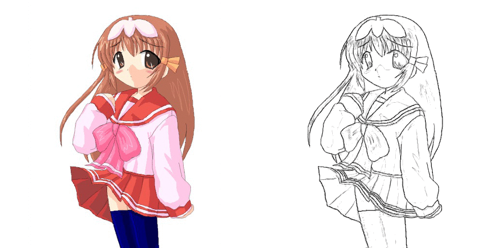
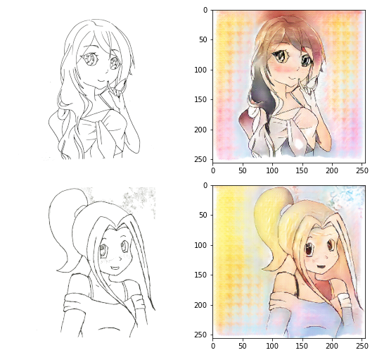
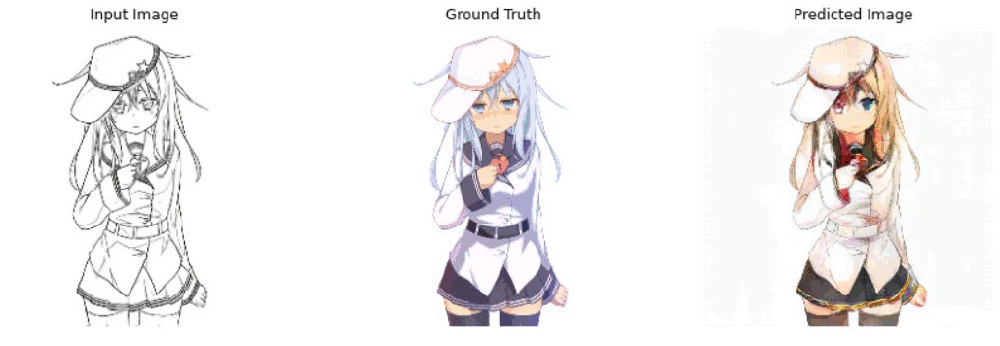

# Sketch-2-Paint

<!-- TABLE OF CONTENTS -->
## Table of Contents

- [Sketch-2-Paint](#sketch-2-paint)
  - [Table of Contents](#table-of-contents)
- [About The Project](#about-the-project)
  - [Aim](#aim)
  - [Description](#description)
  - [Tech Stack](#tech-stack)
  - [Dataset](#dataset)
  - [File Structure](#file-structure)
- [Getting Started](#getting-started)
  - [Prerequisites](#prerequisites)
  - [Installation](#installation)
- [Theory and Approach](#theory-and-approach)
- [Usage](#usage)
- [Results and Demo](#results-and-demo)
- [Troubleshooting](#troubleshooting)
- [Future Works](#future-works)
- [Contributors](#contributors)
- [Acknowledgements and Resources](#acknowledgements-and-resources)
- [License](#license)


<!-- ABOUT THE PROJECT -->
# About The Project
<!-- [![Product Name Screen Shot][product-screenshot]](https://example.com)   -->
## Aim

Aim of this project is  to build a Conditional Generative Adversarial Network which accepts a 256x256 px black and white sketch image and predicts the colored version of the image without knowing the ground truth.

## Description

Sketch to Color Image generation is an image-to-image translation model using Conditional Generative Adversarial Networks as described in  [Image-to-Image Translation with Conditional Adversarial Networks.](https://arxiv.org/abs/1611.07004)

 Refer to our [documentation](https://towardsdatascience.com/generative-adversarial-networks-gans-89ef35a60b69)


## Tech Stack
This section contains the technologies we used for this project.
* [Keras](https://keras.io/)
* [TensorFlow](https://www.tensorflow.org/)
* [Python](https://www.python.org/)
* [Matplotlib](https://matplotlib.org/)
* [Numpy](https://numpy.org/doc/#)  
* [Google Colab](https://colab.research.google.com/)

## Dataset
* [Kaggle Dataset(Anime Sketch Colorization Pair)](https://www.kaggle.com/ktaebum/anime-sketch-colorization-pair)


## File Structure

    ├── assets                 # Folder containing gifs
    ├── notes                  # Notes of project
        ├── 3b1b_notes
        ├── deep_learning_notes
        ├── face_aging
        ├── gans
        ├── linear_algebra_notes
    ├── report                 # Project report
    ├── resources              # List of all resources
    ├── src                    # Source code files
        ├── builddiscriminator.py
        ├── buildgenerator.py
        ├── runmodel.py                 
    ├── LICENSE                # MIT license
    ├── README.md              # readme.md
    ├── sketch_2_paint.ipynb   # colab notebook 

<!-- GETTING STARTED -->
# Getting Started

## Prerequisites
To download and use this code, the minimum requirements are:

* [Python 3.6](https://www.python.org/downloads/release/python-360/) and above
* [pip 19.0](https://pypi.org/project/pip/) or later
* Windows 7 or later (64-bit)
* [Microsoft Visual C++ Redistributable for Visual Studio 2015, 2017 and 2019](https://support.microsoft.com/en-us/help/2977003/the-latest-supported-visual-c-downloads)
* [Tensorflow 2.2](https://www.tensorflow.org/install/pip) and above
* [GPU support](https://www.tensorflow.org/install/gpu) requires a CUDA®-enabled card


## Installation
1. Clone the repo
 ```sh
 git clone https://github.com/KunalA18/Sketch-2-Paint
 ```
 
# Theory and Approach
Generative Adversarial Networks, or GANs for short, are an approach to generative modeling using deep learning methods, such as convolutional neural networks.

Generative modeling is an unsupervised learning task in machine learning that involves automatically discovering and learning the regularities or patterns in input data in such a way that the model can be used to generate or output new examples that plausibly could have been drawn from the original dataset.

GANs are a clever way of training a generative model by framing the problem as a supervised learning problem with two sub-models: the generator model that we train to generate new examples, and the discriminator model that tries to classify examples as either real (from the domain) or fake (generated). The two models are trained together in a zero-sum game, adversarial, until the discriminator model is fooled about half the time, meaning the generator model is generating plausible examples.

GANs are an exciting and rapidly changing field, delivering on the promise of generative models in their ability to generate realistic examples across a range of problem domains, most notably in image-to-image translation tasks such as translating photos of summer to winter or day to night, and in generating photorealistic photos of objects, scenes, and people that even humans cannot tell are fake.


<!-- USAGE EXAMPLES -->

# Usage

Once the requirements are checked, you can easily download this project and use it on your machine.


> NOTE:
>
> 1 - You will have to change the path to dataset as per your machine environment on line #12. You can download the dataset from Kaggle at [https://www.kaggle.com/ktaebum/anime-sketch-colorization-pair](https://www.kaggle.com/ktaebum/anime-sketch-colorization-pair).
>  
> 2 - GANs are resource intensive models so if you run into OutOfMemory or such erros, try customizing the variables as per your needs available from line #15 to #19

* 
  After the execution is complete, the generator model will be saved in your root direcrtory of the project as `AnimeColorizationModelv1.h5` file. You can use this model to directly generate colored images from any Black and White images in just a few seconds. Please note that the images used for training are digitally drawn sketches. So, use images with perfect white background to see near perfect results.

  <br>

  You can see some of the results from hand drawn sketches shown below: 

  

<!-- RESULTS AND DEMO -->
# Results and Demo


# Troubleshooting

If you are planning on using any cloud environments like Google Colab, you need to keep in mind that the training is going to take a lot of time as GANs are computationally quite heavy to run. Google Colab has an absolute timeout of 12 hours which means that the notebook kernel is reset so you’ll need to consider some points like mounting the Google Drive and saving checkpoints after regular intervals so that you can continue training from where it left off before the timeout.


<!-- FUTURE WORK -->
# Future Works

We enjoyed working on GANs during our project and plan to continue exploring the field for further applications and make new projects. Some of the points that We think this project can grow or be a base for are listed below.

1. Trying different databases to get an idea of preprocessing different types of images and building models specific to those input image types.
2. This is a project applied on individual Image to Image translation. Further the model can be used to process black and white sketch video frames to generate colored videos.


<!-- CONTRIBUTORS -->
# Contributors
* [Neel Shah](https://github.com/Neel-Shah-29)
* [Kunal Agarwal](https://github.com/KunalA18)


<!-- ACKNOWLEDGEMENTS AND REFERENCES -->
# Acknowledgements and Resources
* [SRA VJTI](https://www.sravjti.in/) Eklavya 2021  
* Referred [this](https://www.tensorflow.org/) for understanding the use of tensorflow
* Completed [these](https://www.coursera.org/specializations/deep-learning) 4 courses for understanding Deep Learning concepts like Convulational Neural networks and learnt to make a DL model
* Referred [this](https://www.tensorflow.org/tutorials/generative/pix2pix) for understanding code statements
* Referred [this](https://towardsdatascience.com/generative-adversarial-networks-gans-8fc303ad5fa1) to understand the concept of GANs 
* Special Thanks to our awesome mentors [Saurabh Powar](https://github.com/Spnetic-5) and [Chaitravi Chalke](https://github.com/chaitravi-ce) who always helped us during our project journey


<!-- LICENSE -->
# License
The [License](LICENSE) used in this project.
